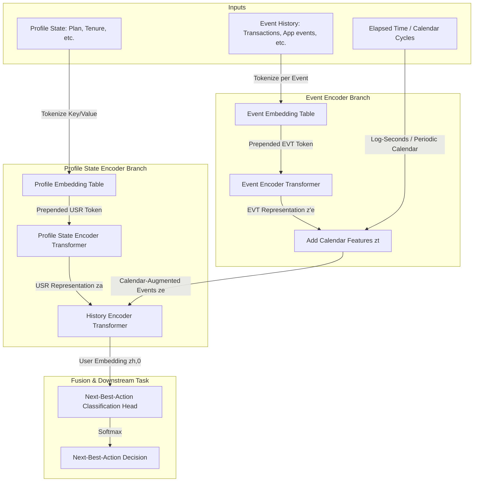

# Implementation Plan: PRAGMA-Based Hyper-Personalisation Model

This document outlines the design, architecture, and step-by-step implementation plan for building a customer next-best-action model inspired by the **PRAGMA foundation model** published by Revolut and NVIDIA (arXiv:2604.08649). 

---

## 1. Architecture Overview

PRAGMA is a **two-branch, hierarchical encoder-only Transformer** designed to process heterogeneous multi-source banking sequences and static customer profile state. Unlike traditional language models, it avoids serializing tabular data into text by maintaining a structured **key–value–time** embedding space.

### Core Components
1. **Key–Value–Time Tokenizer**:
   - **Keys**: Field names (e.g., `Amount`, `Channel`, `MCC`) mapped to unique tokens.
   - **Values**: 
     - **Numerical values**: Quantized into percentile buckets, mapping each bucket to a token.
     - **Categorical values**: Common strings (like plan type or transaction direction) mapped to single tokens.
     - **Textual values**: Subwords learned from BPE tokenization for transaction/event descriptions.
   - **Temporal Information**: Logarithmic elapsed time since the last event, plus periodic calendar features (hour, day-of-week, day-of-month).
2. **Profile State Encoder**: Bidirectional Transformer that aggregates profile-level context (balance, tenure, plan, milestones) into a single `[USR]` representation.
3. **Event Encoder**: Bidirectional Transformer that encodes each event independently (e.g. transaction description, merchant, amount) into an `[EVT]` representation.
4. **History Encoder**: Bidirectional Transformer that ingests the sequence of event representations `[EVT]` concatenated with the customer profile representation `[USR]`, outputting a unified patient history.

---

## 2. Phase-by-Phase Implementation Plan

We will implement a lightweight, fully functional, and locally runnable PyTorch version of the PRAGMA architecture, followed by a suite of tests validating the Next-Best-Action (NBA) workflow.

### Phase 1: Tokenization & Input Formats (First Step)
- Design the schemas for `Event` and `ProfileState`.
- Construct a mock dataset representing a customer making a large deposit after a history of recurring deposits.
- Implement the `PragmaTokenizer` that:
  - Maps semantic types (keys) to token IDs.
  - Disentangles categorical vs. numerical values (percentile bucketing).
  - Computes soft logarithmic elapsed times: $8 \cdot \ln(1 + t/8)$.
  - Decomposes timestamps into calendar cycles.

### Phase 2: PyTorch Model Implementation
- Build custom PyTorch modules:
  - `PragmaEmbedder`: Merges key and value embeddings, adds positional embeddings for multi-word description sequences.
  - `ProfileStateEncoder`: Transformer Encoder for the customer's static and lifelong profile traits.
  - `EventEncoder`: Transformer Encoder for individual events.
  - `HistoryEncoder`: Transformer Encoder for the merged timeline, using RoPE (Rotary Positional Embeddings) for time delta coordinates.
  - `NextBestActionHead`: Classifier mapping the final `[USR]` embedding to next-best-actions.

### Phase 3: Next-Best-Action Training & Testing Pipeline
- Build a downstream training loop using standard Cross-Entropy.
- Define a mock scenario:
  - **Customer A**: History of normal, low-value transactions + high-value deposit.
  - **Intent/Action**: Recommend high-yield savings vaults or investment options.
  - **Customer B**: History of flight tickets, travel insurances + high-value deposit.
  - **Intent/Action**: Recommend multicurrency/travel premium subscription plan.
- Write comprehensive test cases verifying that the model computes the correct embeddings and next-best-actions.

### Phase 4: Roadmap to Gemini Enterprise Agent Platform
- Document how the PyTorch backbone can be wrapped inside a Python agent or microservice.
- Detail the integration with the Gemini Enterprise Agent Platform, leveraging LLMs/Tool-Calling or ADK integration for real-time decisioning.

---

## 3. Current Task Status

- [x] UV Python project initialized.
- [x] PyTorch and CUDA toolkit installed in virtual environment (`.venv`).
- [x] Implementing tokenizer and schemas (`Phase 1`) — completed.
- [x] Implementing PyTorch model modules (`Phase 2`) — completed.
- [x] Writing local validation tests and runnable CLI demo (`Phase 3`) — completed.
